#### **CSCI 1300 CS1: Starting Computing: Project 2**
#### **Hoenigman/Naidu/Park/Ramesh - Fall 2023**
#### **Due: Thursday, December 7th by 11:59pm MST**

# Candy Land

For the Final Project, you will implement a text-based 2-player board game in C++ that draws inspiration from the amusing world of Candyland.
The game will take players through a world full of surprises and challenges.
Players will encounter obstacles, hidden treasures, and confectionary quests in this game.
Get ready to guide your players through this world of candies, where every move is a chance to uncover new, tasty adventures.

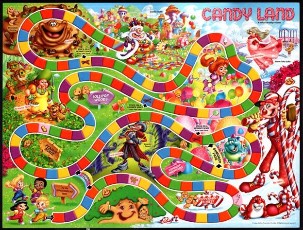

The objective of our game is simple - lead your chosen character on a journey along a colorful trail, with the ultimate goal of reaching the Candy Castle.
This path is paved with tiles of three colors: Cotton Candy Magenta,  Minty Green, and Bubblegum Blue.
Each player draws a card corresponding to one of these colorful tiles that the player moves to.
As they move ahead, the players encounter tiles with special effects that add a layer of fun to the game.

## Table of Contents
**[Game Play](#game-play)**

**[Starting the Game](#starting-the-game)**
> [Loading Game Data](#loading-game-data)
>> [Loading Candies](#loading-candies)
>>
>> [Loading Characters](#loading-characters)
>>
> [Players and Characters](#players-and-characters)
>
> [Character Selection Menu](#character-selection-menu)

**[Board Game Creation](#board-game-creation)**
> [Tile Details](#tile-details)
>
>> [Regular Tiles](#regular-tiles)
>>
>> [Special Tiles](#special-tiles)
>>
>> - [Shortcut Tile](#1-shortcut-tile)
>> - [Ice Cream Stop Tile](#2-ice-cream-stop-tile)
>> - [Gumdrop Forest Tile](#3-gumdrop-forest-tile)
>> - [Gingerbread House Tile](#4-gingerbread-house-tile)
>>
>> [Candy Store](#candy-store)
>>
>>> [Candy Store Menu](#candy-store-menu)
>>>
>>>[Display Available Candies](#display-available-candies)
>>
>> [Hidden Treasures](#hidden-treasures)
>>
> [Display Board Game](#display-board-game)

**[Traveling the Candyland](#traveling-the-candyland)**

**[Deck of cards](#deck-of-cards)**

**[Main Menu](#main-menu)**

**[Calamities](#calamities)**

**[Completing a Puzzle](#completing-a-puzzle)**
> [Riddles](#1-riddles)
>
> [Rock Paper Scissors](#2-rock-paper-scissors)

**[Game end](#game-end)**

**[Checklist](#checklist)**

**[Requirements](#requirements)**
> [Minimum Requirements](#minimum-requirements)
>
> [Extra Credit](#extra-credit)

**[Interview Grading](#interview-grading)**

**[Timeline](#timeline)**

**[Project 2 Points](#project-2-points)**

# Game Play

The game can be summarized by these core concepts:
1. The game starts by selecting your character from a list of available characters. Each character has a different set of attributes.
2. Players navigate a path paved with magenta, green, and blue tiles by drawing cards matching these colors every turn.
3. There are some special tiles on the gameboard where special effects are applied if the player lands on them. They can alter the player's position or attributes.
4. The players must manage their stamina levels. If a player's stamina level drops to zero, they will miss out on two turns until they regain some stamina to move ahead in the game.
5. Candy stores are available on some tiles where players can use their gold coins to purchase a variety of candies.
6. Calamities frequently occur.
7. Players can utilize candies to enhance their attributes or impact their opponents during their journey through Candyland.
8. The player who reaches the Candy Castle first wins the game.

# Starting the Game

Each run of the game should be a little different.
You should begin by loading the candies and characters from the text files. Prompt the user to enter the number of players and their names.
Each player gets to select a character from a list of unique characters, each with distinct amounts of gold, stamina, and candies ([See Character Selection Menu](#character-selection-menu)). The players have a chance to visit the candy store before starting the game ([See Candy Store](#candy-store)).
Each candy loaded from the file has to be stored as a struct to facilitate the smooth implementation of various aspects of the game.

The minimum requirement for the number of tiles on the gameboard is 83.
[See Board game](#board-game-creation) description for more details.

For each turn in the game, you should display the Main Menu, including the current position of players on the board and a relevant action menu for the space the player is currently on.

## Loading Game Data

### Loading Candies

The candies are written in the Candies.txt file. This file holds the name, description, effect type, effect value, candy type, and the price on each line, separated by a vertical bar, |. For more details about candies, refer to [Candy Store Menu](#candy-store-menu).

   Here is the content of the file:

      Name|Description|Effect type|Effect value|Candy type|Price
      Frosty Fizz|Boosts player's stamina by 10 units|stamina|10|magical|10
      Toxic Taffy|Decreases opponents stamina by 20 units(strong)|stamina|-20|poison|25
      Caramel Comet|Protects against all poison candies|other|3|immunity|25
   You should re-use the Candy struct created in Homework 7 and modify it accordingly.

### Loading Characters

The list of characters players can choose from is in the characters.txt file. This file holds the name of the character, followed by the amount of gold, stamina, and a list of candies that the character possesses. Each line is separated by vertical bars, |. The list of candies are separated by commas.

Here is a sample content from the file:
<pre><code>character name|stamina|gold|candies
JellyBean_Jane|100|50|Breezy Butterscotch,Lucky Licorice,Fearsome Fudge,Crimson Crystal
</code></pre>

## Players and Characters
The game begins by asking the number of players that intend to participate (a minimum of 2 players are required). For each player, a character selection menu is displayed.
Players choose a character of their choice to proceed in the game.
For this project, we require you to create a minimum of four characters for a player to choose from.
Each character has a different amount of gold, stamina, and candies.
You may create other unique characters with distinct values for each attribute.
In doing so, ensure that the characters are balanced and fair.

We provide a sample characters file that has two characters with different attributes for you to start.
Feel free to add/modify the file and load the characters by reading from the file.

## Character Selection Menu
The menu displays the available characters that the player can choose from.
Make sure a character is chosen only once in the game.
The menu should only display the characters that have not been chosen yet.
Once the players select their characters, they start the game with the resources allotted to their characters.

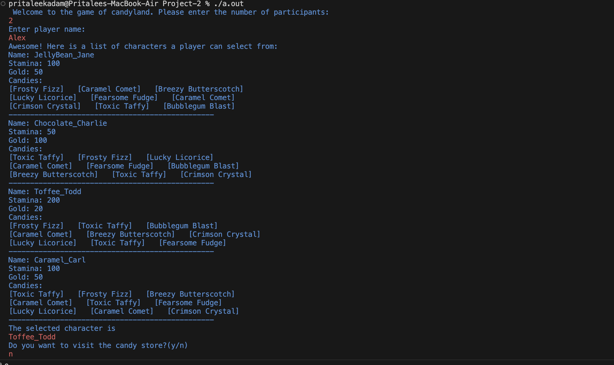
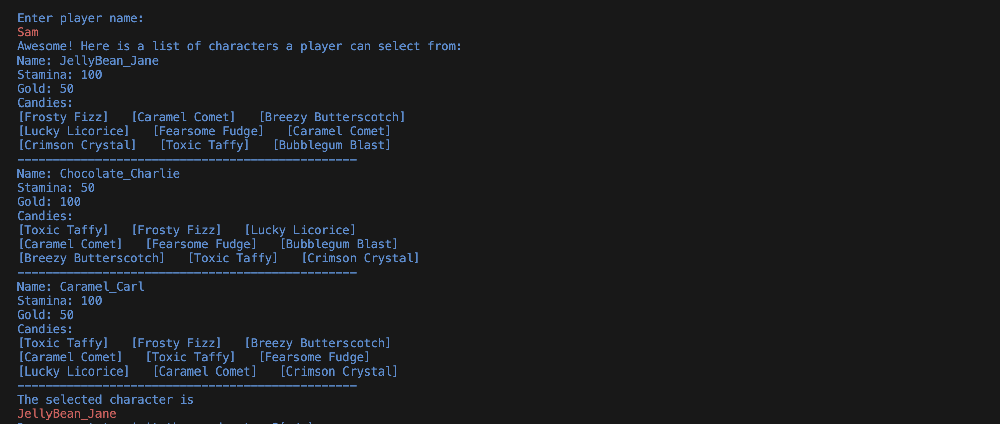

# Board Game Creation
The board game is a trail made up of 83 colorful tiles. We have three different color tiles - Cotton Candy Magenta, Minty Green, and Bubblegum Blue. Feel free to add more color tiles on the board.

## Tile Details
Candyland's heart lies in its colorful tiles. There are two types of tiles: [Regular Tiles](#regular-tiles) and [Special Tiles](#special-tiles).
The path is lined with regular tiles, enticing you with the flavors of magenta, green, and blue.
On the other hand, special tiles introduce surprises into your journey.

### Regular Tiles
The path through Candyland is paved with regular tiles. Each time a player draws a card, they move forward to the nearest tile that matches the color on the card.
See [Deck of Cards](#deck-of-cards) for more details on cards.
Each step along this path brings you closer to the Candy Castle, the ultimate destination.
After you land on a regular tile, there is a 40% chance a calamity can occur. See [Calamities](#calamities) for more details.

### Special Tiles
Candyland wouldn't be complete without its special tiles, designed to sprinkle an extra dose of magic into your journey.
There are 4 different types of special tiles that a player can encounter:

#### 1. Shortcut Tile
Landing on a Shortcut Tile is like finding a hidden passage through the candy-coated landscape.
You get the golden opportunity to leap forward by four tiles, skipping ahead and making rapid progress towards the Candy Castle. If a player is less than 4 tiles from the castle when encountering this tile, the player will end up on the castle.

#### 2. Ice Cream Stop Tile
The Ice Cream Stop Tile is a welcome break in your candy-filled journey.
You can draw a card again, granting you an additional turn.

#### 3. Gumdrop Forest Tile
The Gumdrop Forest Tile is a tricky spot in Candyland.
It's a place of both enchantment and challenge.
You'll be taken four tiles back, losing a random amount of gold coins (5 - 10 gold).
If a player is less than four tiles into the game and encounters this tile, they get sent back to the start of the game.

#### 4. Gingerbread House Tile
The Gingerbread House Tile holds a mysterious secret.
When you step on this tile, you'll be transported back to your previous position on the path.
However, this journey comes at a cost, as you'll lose one of your valuable immunity candies.

### Same Tile constraints
When two players land on the same tile, the first player to land on the tile gets an opportunity to rob gold from the other player.
The first player to land on the tile can steal a random amount (5-30 coins) of the other player's gold stock. But there is a twist: if the opponent has a special shield called Robber's Repel, the opponent can protect itself from the robbery.
The player who reaches the tile first will be moved back by one tile, while the one who arrives later will remain on the tile.

### Hidden Treasures
Underneath certain tiles in Candyland, hidden treasures are waiting to be found. There needs to be three hidden treasures on the board randomly.
If a player has the good fortune to land on one of these tiles, they'll face a captivating challenge – solving a riddle to unlock the treasure. See [Riddles](#1-riddles) for more details.
The reward is worth the effort, as these treasures can bring various benefits. Once the puzzle is solved, the player gets rewarded with one of the following:
1. Stamina Refill (30% chance):
   The amount of stamina replenished is a random event, with the player receiving between 10 to 30 units of stamina.
   However, it's important to note that a player's maximum stamina is capped at 100.

2. Gold Windfall (10% chance):
   The amount of gold retrieved is random, with the player receiving a windfall of between 20 to 40 gold coins.
   However, be aware that a player can carry a maximum of 100 gold coins, ensuring they don't become weighed down by their riches.

3. Robber's repel (30% Chance):
   This candy acts as an anti-robbery shield, safeguarding the player's gold from potential theft by others during their journey. It comes into effect when another player attempts to swipe your gold while on the same tile as you.

4. Candy Acquisition (30% chance):
   Two types of candies can be found in the treasure:

    a. Jellybean of Vigor (70% Chance): This special candy offers some amount of stamina regeneration, providing a valuable boost to the player's energy levels. The only way one can find this candy is from the hidden treasures.
    Using the Jellybean of Vigor, you can restore 50 units of stamina.
    Make sure the stamina of a player does not exceed 100 units.

    b. Treasure Hunter's Truffle (30% Chance): This candy allows the player to unlock a hidden treasure. They can then access the hidden treasure by solving a riddle, just like other hidden treasures.

### Candy Store
When you land on a tile with a candy store, you can purchase Candy using your gold reserves. You will visit the candy store before beginning the game.

Each candy store has different types of candies. Candy stores will be randomly positioned on the Candyland trail with a small constraint. In the first 27 tiles, a candy store will be on a magenta-colored tile. Between tiles 28 and 54, a candy store will appear on a green-colored tile. And from tile 55 to 82, a candy store will be on a blue tile.

#### Candy Store Menu:

The players are greeted with three randomized candies at each candy store. 4 different types of candies can be bought.
The list of types of candies that can be purchased at the store are:

1. Magical Candy:
Magical Candy has the power to boost your stamina by a number of units(10, 15, 20).

2. Poison Candy:
Poison Candy can be strategically gifted to another player, causing a reduction in their stamina by some units(10- mild, 15- moderate, 20- Strong).
However, players who possess an Immunity Candy have the ability to defend themselves against the poison.
When used, the Poison Candy and the Immunity Candy are both consumed, ensuring no stamina loss.

3. Immunity Candy:
If you find yourself under the threat of poison, this candy comes to your rescue. Different variations offer varying levels of protection. Some guard against mild poison candy, some against mild and moderate, while others shield against all poison candies. Both the Immunity and Poison candies are utilized in this process.

      <pre><code>E.g. If you have these candies:
      Lucky Licorice|Decreases opponents stamina by 10 units (mild)|stamina|-10|poison|15
      Venomous Vortex|Decreases opponents stamina by 15 units(moderate)|stamina|-15|poison|20
      Toxic Taffy|Decreases opponents stamina by 20 units(strong)|stamina|-20|poison|25

      Bubblegum Blast|Protects against mild poison candy|other|1|immunity|15
      Sparkling Sapphire|Protects against mild and moderate poison candies|other|2|immunity|20
      Caramel Comet|Protects against all poison candies|other|3|immunity|25
      </code></pre>
      - Bubblegum Blast will only protect against Lucky Licorice.
      - Sparkling Sapphire will only protect against Lucky Licorice and Venomous Vortex.
      - Caramel Comet will protect against all the poison candies: Lucky Licorice, Venomous Vortex, and Toxic Taffy.

4. Gummy Candy:
Gummy Candy creates a temporary barricade on a tile, causing other players who land on that tile to lose some number of turns (1 or 2).
It serves as a tool for slowing down your opponents and gaining an edge in the race to the Candy Castle.

### Display Available Candies:
The Candy Store menu displays a selection of candies that the players can choose from.
The players can explore the list of candies available at a candy store, each with its unique name, cost, and effects. Each candy store is limited to 3 random candies, and a player can only purchase one candy from a candy store.

Be aware that you have to store the candies possessed by a player in an array. A player can have only 9 candies at a time.
If your array is at capacity and you find/purchase a candy, you should implement a candy substitution menu option. (Ask the player if they wish to substitute any candies they have for the new candy)
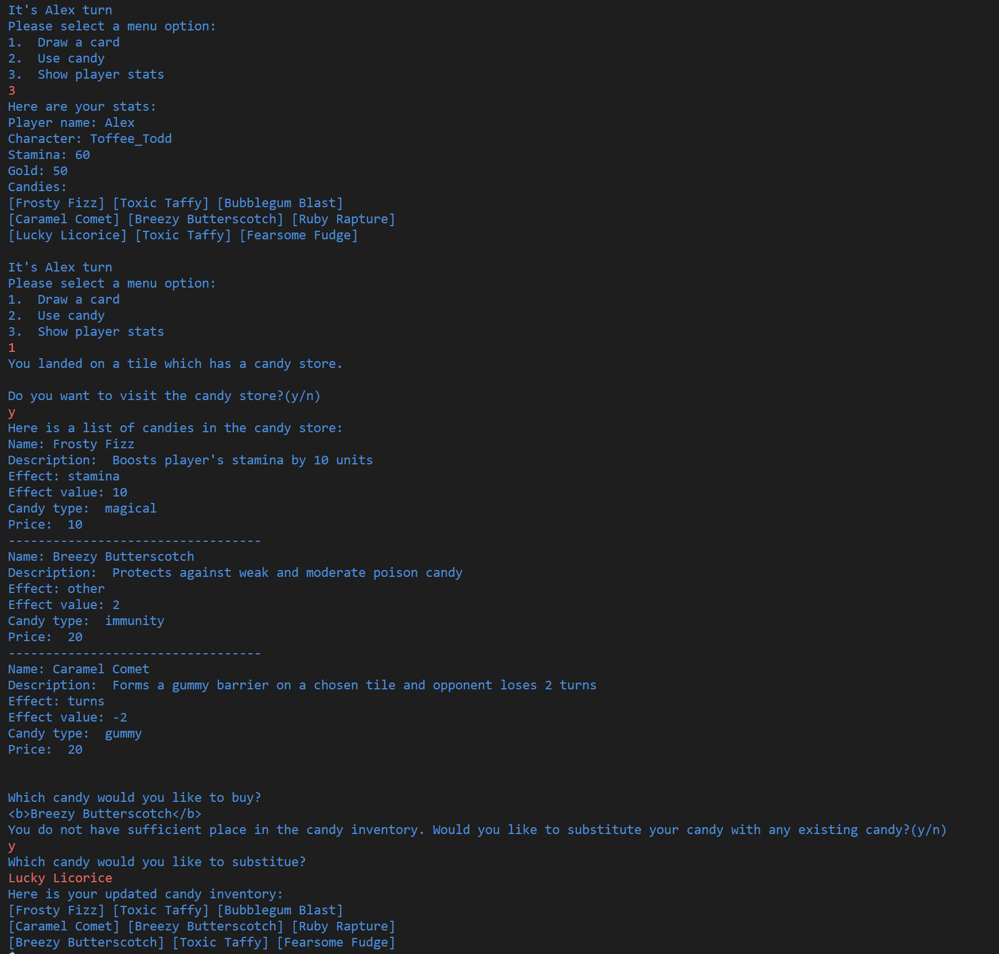

## Display board game
To visualize the game board in the terminal, the complete 83-tile trail is displayed, with each tile distinguished by its designated color. The trail is displayed in a zig-zag form, as shown below.
To indicate the position of each player on the tile, the player's unique identifier is used to mark their presence. To identify the final tile as a Castle, the color of the tile should be different from the other tiles.

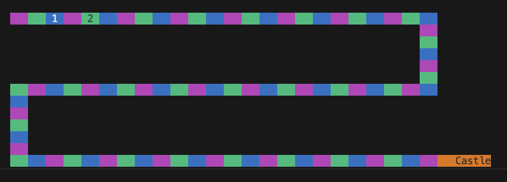

You are encouraged to tweak any colors or probabilities of events and add additional options to make the game more interesting.

# Traveling the Candyland
To traverse the terrain of Candyland, players draw cards from a deck, each card revealing a color that guides their path. Players then advance to the nearest tile matching the color on the drawn card. With every turn a player takes in Candyland, stamina decreases by one unit. The player misses out on two turns if their stamina levels drop to zero until they regain 20 units of stamina to move ahead in the game.
After moving, the updated position of the players are displayed on the trail. ([See Deck of cards](#deck-of-cards))

Upon encountering a special tile, a message in the terminal informs of the unique find.
The type of special tile dictates the message you receive, with each tile offering its own distinct effect ([See Special Tiles](#special-tiles)).

Specific messages are shown based on the type of special tile:
- Shortcut Tile: Your spirits soar as you're propelled four tiles ahead, closing in on the Candy Castle.
- Ice Cream Stop Tile: Congrats! You get a chance to draw a card again.
- Gumdrop Forest Tile: Oops, You head back 4 tiles and lose 5 gold.
  - Note: the 5 gold is randomly generated.
- Gingerbread House Tile: It's a bittersweet return to your previous location, accompanied by the forfeiture of one immunity candy.

The player's position on the trail is updated in response to the special effects applied.

When you land on a tile with a candy store, a prompt reveals the store's presence, inviting you to explore its tempting offerings.
Here, you can exchange your gold for a candy that could turn the tide of your adventure.

When you land on a tile concealing a hidden treasure, a prompt reveals the treasure's presence.
You can attempt to unlock it by solving a riddle. [See Riddles](#1-riddles) for more details.
Successfully solving the riddle allows you to claim the treasure, while an incorrect answer results in a missed opportunity.

# Deck of Cards
In Candyland, our game relies on a unique deck of Cards to add an element of chance and excitement to your journey.
These cards come in three colors: magenta, green, and blue, each representing a regular move,
and their rarer counterparts: double magenta, double green, and double blue, offer an opportunity to advance two tiles(same color) further. When a player draws a card from the deck, a message prompt informs them of the card type, indicating whether it's a single-color or double-color card.
The double-color cards allow a player to advance two tiles further of the same color when drawn. So, if a player draws a double minty green card, for instance, they'll progress two green-color tiles ahead instead of one.
Every turn, players randomly select a card from this deck, shaping the course of their adventure.

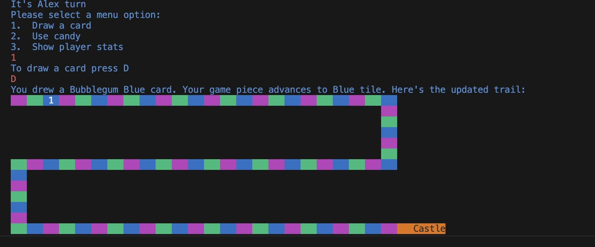
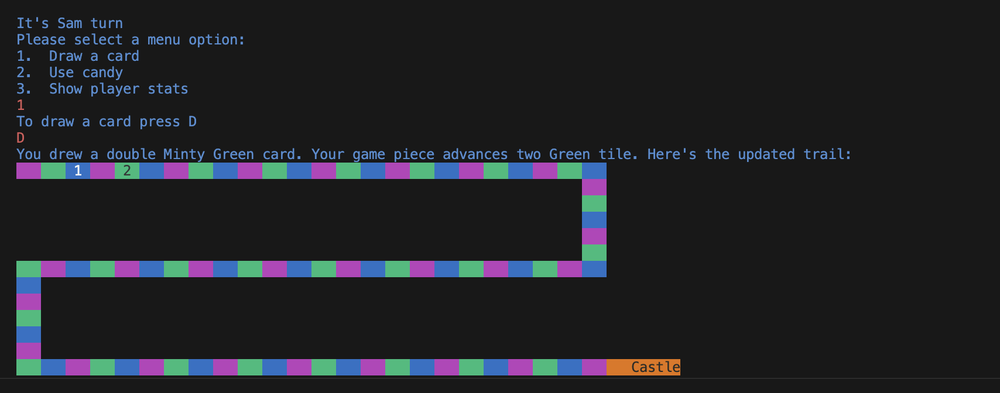

Again, feel free to customize the probabilities of drawing a double card from the deck to suit your vision of Candyland.

# Main Menu
For each turn, display a menu that shows the player three options:
1. Draw a card
2. Use candy
3. Show stats

Draw a card - Prompt the user to draw a card from the deck. Display the color of the drawn card and show the updated position of the player on the board.

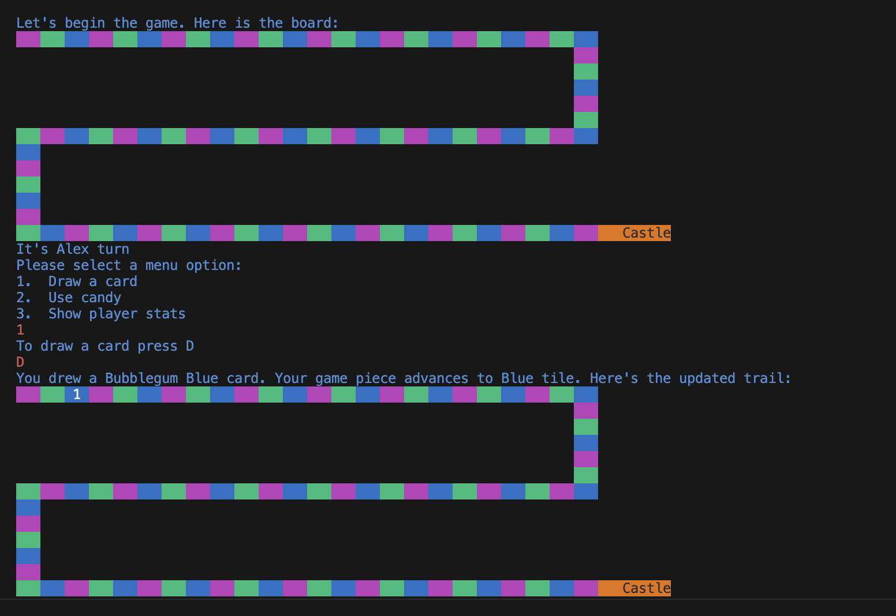

Use candy - Prompt the user to select a candy from their list of available candies. Modify the player attributes according to the effect of the candy and print the message to the user.

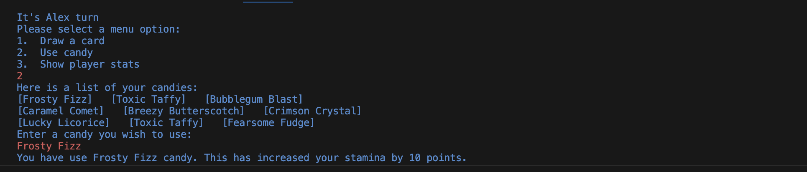
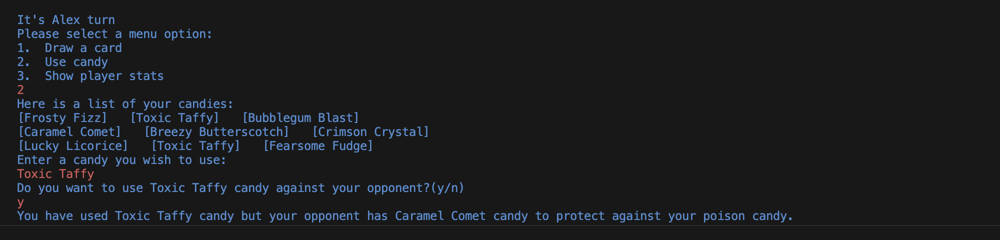

E.g., For Gummy candy
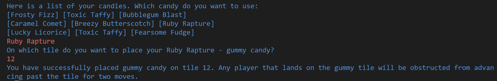

Show stats -  Display stamina, gold, and candies for that player
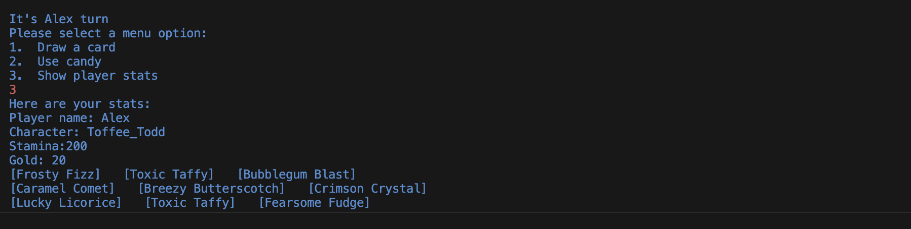

# Calamities
In this unpredictable world, calamities can strike when you least expect them, adding a twist to your journey.
Each turn in the game, after the player moves ahead to a regular tile, there is a 40% chance a calamity might occur.
If a calamity occurs at the end of a particular turn, choose one of the following events according to the probability.
We provide probabilities but feel free to change the probabilities or even add additional calamities.

1. (30% Chance) Candy Bandits! - You encounter a mischievous gang of candy bandits who steal your precious resources.
   You lose a random amount of gold coins (1-10 coins). A message announces the calamity:
    "Oh no! Candy Bandits have swiped your gold coins!"

2. (35% Chance) Lost in a Lollipop Labyrinth - You stumble upon a convoluted lollipop forest and get lost within its sugary twists and turns.
   This costs you a turn while trying to find your way back. A message informs you:
    "Oh dear! You got lost in the lollipop labyrinth!"
    But you can recover the damage by playing Rock, Paper, Scissors [See Rock Paper Scissors](#2-rock-paper-scissors). If you win, you get the lost turn back.

3. (15% Chance) Candy Avalanche! - A sudden candy avalanche engulfs you, causing damage and confusion.
   You lose 5-10 units of stamina, and you must skip the next turn to recover. A message warns:
    "Watch out! A candy avalanche has struck!"
   But you can recover the damage by playing Rock, Paper, Scissors [See Rock Paper Scissors](#2-rock-paper-scissors). If you win, you get the lost resources back.

4. (20% Chance) Sticky Taffy Trap - You unknowingly step onto a sticky taffy trap and get entangled in the gooey mess.
   This makes you immobilized for the next turn, unable to move or act. A message conveys the situation:
    "Oops! You are stuck in a sticky taffy trap!"

   If you find yourself stuck in the sticky taffy trap, there's hope for a quick escape!
   If you have a Magical Candy in your inventory, you can use it to regain your lost turn.

**Note:** If you want to implement "positive events", you are free to include those as well.
For example, you stumble upon a hidden trove with a magical candy that can be used to gain additional stamina.

# Completing a Puzzle

## 1. Riddles:
These are a set of questions and answers that are stored in a text file. We provide a few riddles in the riddles.txt file but feel free to add/modify the riddles as you’d like.
If you accept the challenge to answer the puzzle, the game retrieves a random question from the list of questions. Should you succeed, the reward gets added to your existing attributes.

The riddles are written in the riddles.txt text file. This file holds the question and the answer in each line, separated by a vertical bar, |.

   Here is the content of the file:

   <pre><code>What gets wet while drying? (single word, lowercase)|towel  
How many letters are in the alphabet? (integer)|11
What are the next three letters in this sequence: OTTFFSS? (no spaces, uppercase)|ENT
</code></pre>  

## 2. Rock Paper Scissors:
This is a classic game of Rock, Paper, Scissors where the player faces off against the computer. The player has three choices to pick from, and the computer's selection is randomly generated. The choices are then displayed, and the winner is determined based on Rock, Paper, and Scissors rules. You can re-use the code written in Homework 7; however, the program should randomly generate the computer's choice.

# Game end
Candy Castle is considered to be any color, meaning if you draw a blue card and there are no blue tiles between the current player's location and the Candy Castle, you move to the Candy Castle which ends the game.
Once the game ends, your program should print a message congratulating the player on their success.
You should also print the following statistics for each player in the game:

1. Name of the player and their character
2. Amount of Gold Left
3. Stamina Left
4. Candies in the player’s possession

You should also save the final stats of the game in a file named results.txt. You can choose the format of this file.

# Checklist

Below is our suggested sequence of components to code and test. We recommend testing the sections along the way. Some of the components are intertwined; therefore, you can leave a cout statement (placeholder) and come back later.

* Loading the game components
* Selecting the characters
* Move on the map by drawing cards
* Add the tile effects
  * Special tile effects
  * Same tile constraints
  * Hidden treasure
* Candy store components
* Using different candies
* Puzzle
  * Riddles
  * Rock Paper Scissors
* The calamities

# Requirements

The minimum requirements for this final project are in the following sections. You are not allowed to use pointers or global variables in the project.

## Minimum Requirements
Your implementation of Candy Land should have the following:
1. A minimum of 83 tiles on the board, with at least 3 colored tiles and a unique color for the Candy Castle.
2. The shape of the game board should be similar to an "S", with at least 3 twists.  
3. At least 4 special tiles with a minimum of 25% chance of a tile being a special tile.
4. At least 3 candy stores, excluding the one you visit at the beginning of the game.
5. At least 3 hidden treasures in the game.
6. A minimum of 4 characters that the players can select from.
7. A minimum of 4 different candy types.
8. Working implementation of Rock Paper Scissors and Riddle games.
9. Card must be a struct with two attributes - color and x2 feature.
10. A minimum of 4 calamities.
11. Writing the game stats to a file.
12. At least 3 user-defined classes.
13. At least two classes with 4+ data members.
14. At least one class must include an array of objects from a class that you created.
15. Appropriate methods for each class (including getters, setters, default constructors, and parameterized constructors as needed)

Your project implementation must include at least the following:
1. 6+ if-else statements
2. 6+ loops (while loops, for loops, do-while, in total)
3. 2+ nested loops
4. An array of struct in one class
5. File IO (both reading from a file and writing to a file)
6. Your project must have an interactive component (ask the user for input, create a menu for choices, etc.).
7. Game stats should be displayed as instructed at each turn. It's more exciting and meaningful! Also, these stats help debug the code.

## Extra Credit
Following are some extra credit opportunities available for this project.

1. **Present your project (10 points)** during the lecture or through a video.
   * **Lecture**: A sign-up sheet will be shared a week before class presentations
   * **Video**: Make a 5-minute (+ or - 1 min) video explaining:
      * The project idea
      * Implementation and approach
      * A demonstration of the working project

2. **Discount at candy store (10 points)**
The player is presented with a jumbled word related to candies, and they need to unscramble it to reveal the correct candy name. To receive a 10% discount, they must unscramble a certain number of words. If they unscramble the required number of words, they get the discount; if not, they pay 10% more for their candies.

3. **Marshmallow Hailstorms (10 points)**
Marshmallow Hailstorms are unpredictable weather effects that can impact player movement.
For instance, a strong wind could suddenly blow through the Candyland, pushing a player backward by a random number of steps.
This is a random event and has a 5% chance of occurring on any tile in the gameboard.
When a Marshmallow Hailstorm strikes, it can cause all the players to be moved backward by a random number of tiles.

4. **Multiplayer game - More than 2  (5 points):**
Develop a game that can be played by more than 2 players(4 or 8).

# Interview Grading
The Project 2 interview grading scheduler will be available on Canvas before the deadline of this project. The interviews will take place between December 8th and December 14th. If you don’t sign-up between December 4th and December 7th or you miss your interview, then no points will be awarded for the project.

During the interview grading, TAs will be playing your game and asking conceptual questions. They will also ask about your functionality and implementation.

# Timeline

- **Monday, November 27th at 11:59 pm: Submit class files & Code Skeleton.** Your .h files should be complete with all the data members and member functions you will be using for each class. For the class implementation .cpp files, you should fully implement simple functions like your getters and setters. For more complex functions, you can include the function prototype with detailed comments.

- **Wednesday, December 6th at 11:59 pm: Interview Grading Sign-Up deadline.** You must sign up for an interview grading timeslot no later than Wednesday, December 6th at 11:59 pm. The interviews will take place between December 8th and December 14th. If you don't sign-up or miss your interview, then no points will be awarded for the project.

- During the interview grading, TAs will be playing your game and asking questions about it. They will also ask about your implementations and conceptual questions.

- **Thursday, December 7th at 11:59 pm: Final Deliverables.** Your project will be due on Thursday, December 7th at 11:59 pm. You must submit a zip file to the Project 2 assignment on Canvas, including all .h and .cpp files. The submission should compile and run. TAs will also be grading comments and styles.

- **Saturday, December 9th at 11:59 pm: Project Report.** Write a 1-2 page report containing the following reflection questions:

  - How did you prepare for the project?
  - How did you develop our code skeleton? In what way(s) did you use your code skeleton?
  - Reflect on how you could have done better or how you could have completed the project faster or more efficiently.
  - In addition, write a paragraph answering the following question, in the context of the Project in CSCI 1300: Did you have any false starts, or begin down a path only to have to turn back when figuring out the strategy/algorithm for your Final Project program? Describe in detail what happened, for example, what specific decision led you to the false starts, or, if not, why do you think your work had progressed so smoothly. In either case, give a specific example.
  - The report should be a 1-inch margin, single space, 12pt font size, Times New Roman. Submit a report as PDF to Project2 Report on Canvas.

- **Saturday, December 9th at 11:59 pm: Project 2 Quiz.** Complete the project 2 quiz.

# Project 2 Points
Project 2 is worth 250 points. Here is a summary of the points.

| **Criteria**                                                      | Points |
| ----------------------------------------------------------------- | ------ |
| Code Skeleton                                                     |   10   |
| Project Report                                                    |   10   |
| Minimum Implementation Requirements                               |   30   |
| Game functionality                                                |   75   |
| Game Compilation, Algorithm, Comments, Style, Interview Questions |   75   |
| Project 2 Quiz                                                    |   50   |
| Total                                                             |   250  |

**Note:** 
 - If your code does not compile, you cannot score above 70 points for the project
 - The use of global variables and pointers will result in a 0 on the entire project
